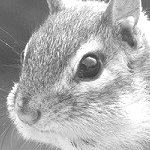
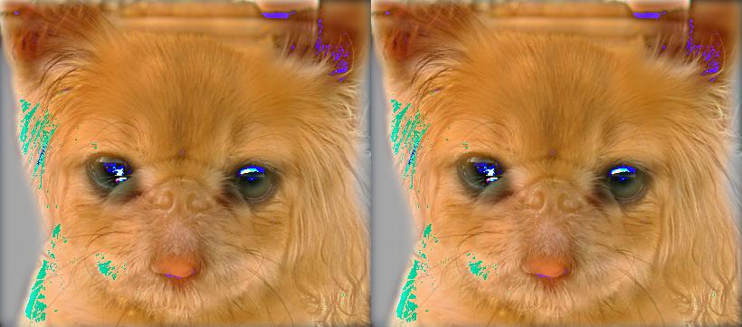
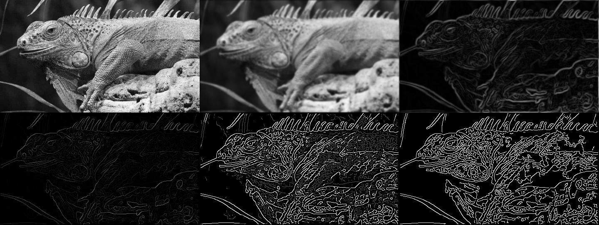
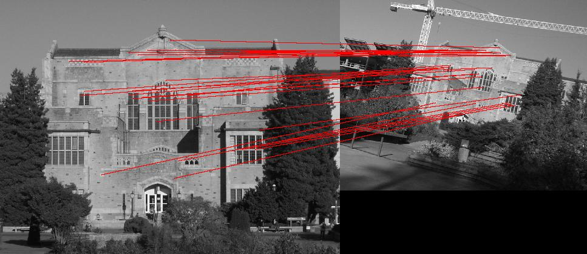
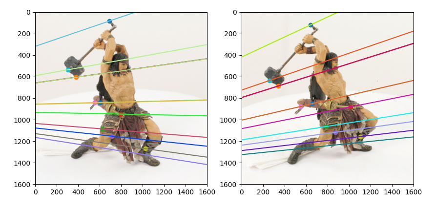

# pnu_computer_vision_2022

This repository is archive for assignments in pnu computer vision lecture.

## Images

### 01. Image manipulation with numpy and PIL

### 02. Image filtering and hybrid image

### 03. Canny edge detection

### 04. RANSAC

### 05. Panorama

### 06. Epipolar
